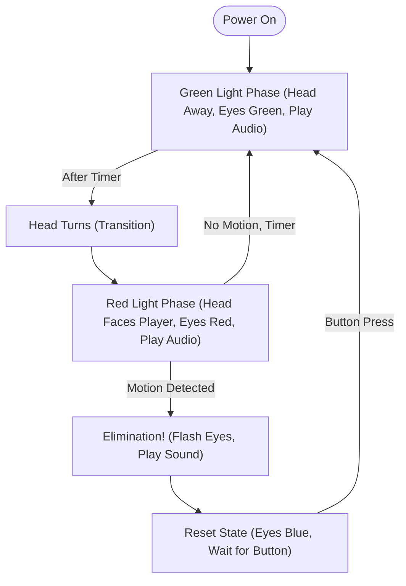

# 🦑 Squid Game Doll – Embedded Real-Time Motion Detection System

---

## 📋 Table of Contents
- [Features](#features)
- [How it Works](#how-it-works)
- [Wiring](#wiring)
- [Audio Files](#audio-files)
- [How to Use](#how-to-use)
- [Uploading](#uploading)
- [Troubleshooting](#troubleshooting)
- [FAQ](#faq)
- [Contributing](#contributing)

---

## ✨ Features
- 🎮 "Red Light, Green Light" game logic with state machine
- 🤖 Head rotation and tilt (2 servos)
- 👀 Motion detection (PIR and/or Ultrasonic)
- 🔊 DFPlayer Mini audio playback
- 👁️ RGB LED eyes (color control)
- 🔄 Game reset button (debounced, reliable)
- ⏱️ Non-blocking timing (uses millis())

---

## 🛠️ How it Works

---

## 🪛 Wiring
See [`wiring.txt`](wiring.txt) for detailed connections and pin mapping.

---

## 🎵 Audio Files
- Place `0001.mp3` ("Green Light"), `0002.mp3` ("Red Light"), `0003.mp3` ("Elimination") on SD card for DFPlayer Mini.

---

## 🚦 How to Use
1. Power up the system.
2. The doll cycles between **Green Light** (safe) and **Red Light** (motion detection).
3. If motion is detected during **Red Light**, elimination sound and effect are triggered.
4. Press the button to reset/restart the game.

---

## ⬆️ Uploading
1. Install [Arduino IDE](https://www.arduino.cc/en/software).
2. Install Libraries:
   - Go to *Sketch > Include Library > Manage Libraries...*
   - Search for and install:
     - `DFRobotDFPlayerMini`
     - `Servo`
3. Connect Arduino UNO via USB.
4. Copy-paste the code into a new sketch named `SquidGameDoll.ino`.
5. Select Board & Port:
   - *Tools > Board > Arduino UNO*
   - *Tools > Port > (your Arduino port)*
6. Upload the sketch.

---

## 🛠️ Troubleshooting
- **Servos jitter or don’t move:**
  - Use a separate 5V supply for servos. Don’t power from Arduino 5V if both servos are used.
- **DFPlayer Mini not found:**
  - Check wiring (TX/RX), SD card format (FAT32), and audio files named `0001.mp3`, `0002.mp3`, `0003.mp3`.
- **LEDs not lighting:**
  - Check wiring, resistors, and correct pin assignments.
- **Button not working:**
  - Ensure it’s wired between pin and GND, with `INPUT_PULLUP` enabled.
- **Motion not detected:**
  - Test PIR and ultrasonic sensors separately with simple sketches.

---

## ❓ FAQ

**Q: Can I use only one motion sensor?**
> Yes! The code works with either PIR or ultrasonic, or both for extra reliability.

**Q: Can I use different audio files?**
> Yes, just rename your files to `0001.mp3`, `0002.mp3`, and `0003.mp3` on the SD card.

**Q: The eyes are not the color I expect!**
> Double-check your wiring and that you are using common cathode RGB LEDs.

**Q: Can I add more features?**
> Absolutely! Fork this project and contribute your ideas.

---

## 🤝 Contributing

1. Fork this repository
2. Create a new branch (`feature/your-feature`)
3. Commit your changes
4. Open a Pull Request

All contributions, suggestions, and bug reports are welcome!

---

> Made with ❤️ for makers, tinkerers, and Squid Game fans! 
